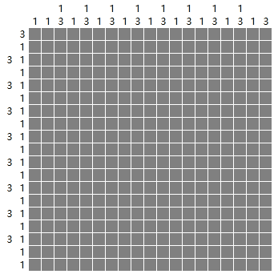
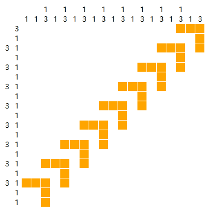

# Picrosser
A Simple Picross Solver

## Why I write this
I know there are lots of research on this problem have been done, and tons of picross solver have been made. But I am trying to do it by myself, to see how far I can get before I read research and others' program on th Internet. The reason are:
 - (MOST IMPORTANT) Nintendo's recent game, Pokemon Picross, is driving me mad! I want to solve those puzzle quickly, but still using my own thought. So I make a program helping me solve those puzzle. Since the program is written by myself, it's not cheating!
 - I am learning C# these days, so I write this in C# to get familiar with those syntax and librarys. And...
 - I just love coding :smile:


## Usage (GUI version)

### A simple example
For a Picross puzzle like this:


(Shoot from Pokemon Picross on my 3DS)

Type the following text into the text box: ([txt here!](Examples/example1.txt))
```
3
5
3 1
3 2
3 2
3 3
4 1
4 2
4
4 4

4
7
8
8
1
1 1
2 1 1 1
2 3 1 1
2 2 1
2 2
```

Then click 'Submit Picross', and click 'Solve this', you will get the result:


### A not-so-simple example
Here is another Picross puzzle: ([txt here!](Examples/example2.txt))



After typing the numbers into the window as we did in the first example, 
click 'Submit Picross' and 'Solve this', you will get message box indicating that
this is a hard puzzle that the program cannot solve in the simple way, 
and ask if try to search all solutions. This is often caused by a puzzle with multiple solutions (but not for this example, which truly has a unique solution). 

Now click 'Yes', then the program will begin searching (currently the algorithm is implemented as a stupid DFS, and it may take several seconds or minutes to search). Then each time the program find a solution, it will show the solution and ask if to continue. The searching will stop when choosing not to continue, or it has searched all possibility. 

As for this example, the program will find its unique solution:



On my computer, it takes around 8s to find solutions of this example.

## Usage (console version)
Input a file

```
>PicrosserConsole Examples\example1.txt
=======================
             * * * *
       * * * * * * *
     * * * * * * * *
     * * * * * * * *
     *
   *               *
 * *   *       *   *
 * *   * * *   *   *
 * *     * *       *
   * *     * *
Finished
```
or type the puzzle into the console while running:
```
>PicrosserConsole
Please input the picross puzzle:
1 1
1 1
1 1
1 1

1 1
1 1
1 1
1 1

=======================
 *   *
   *   *
 *   *
   *   *
=======================
   *   *
 *   *
   *   *
 *   *
Finished
```
(Note that two new lines should be typed to finish input)

In console version, the solver will automatically begin a search algorithm to find all solutions.

